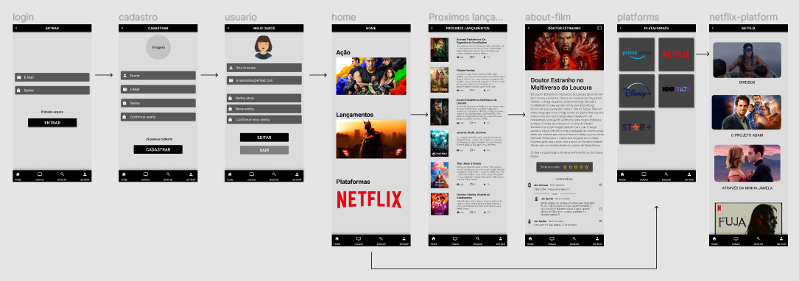
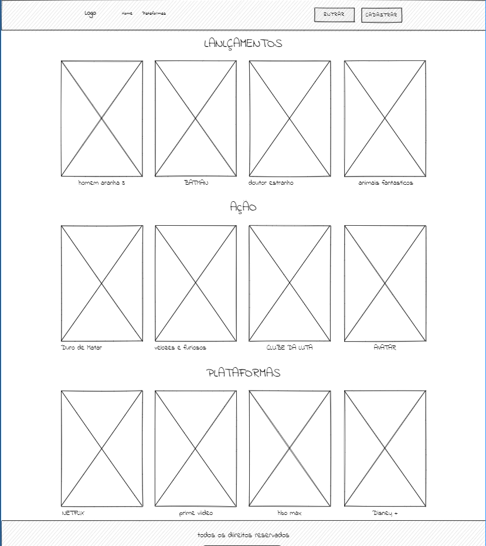
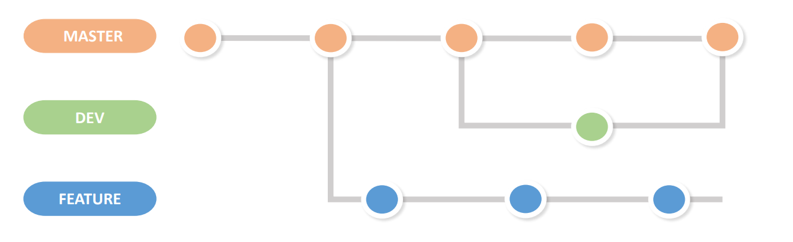

# Informações do Projeto
`O que assistir`  

Nesse projetos buscamos realizar um software que facilita a escolha de filmes ou séries de forma que diminua a indecisão das pessoas na hora da escolha.Com o software as pessoas vão ter recomendações de uma maneira mais precisa e conhecer séries e filmes que serião difícil de conhecer sem o software.

`Engenharia de software` 

Curso que ajuda na formação de um profissional muito mais completo e que possa atuar em várias áreas em que um software pode abordar. 

# Participantes: 
* José Miguel Quintão Magalhães
* Lucas Perlatto Lotti Garcia
* Marcelo Aguilar Araújo Dalmeida
* Marcus Viniccius Souza de Freitas
* Samuel Marques Sousa Leal
* Victor Ricci Perlatto

# Estrutura do Documento

- [Informações do Projeto](#informações-do-projeto)
  - [Participantes](#participantes)
- [Estrutura do Documento](#estrutura-do-documento)
- [Introdução](#introdução)
  - [Problema](#problema)
  - [Objetivos](#objetivos)
  - [Justificativa](#justificativa)
  - [Público-Alvo](#público-alvo)
- [Especificações do Projeto](#especificações-do-projeto)
  - [Personas e Mapas de Empatia](#personas-e-mapas-de-empatia)
  - [Histórias de Usuários](#histórias-de-usuários)
  - [Requisitos](#requisitos)
    - [Requisitos Funcionais](#requisitos-funcionais)
    - [Requisitos não Funcionais](#requisitos-não-funcionais)
  - [Restrições](#restrições)
- [Projeto de Interface](#projeto-de-interface)
  - [User Flow](#user-flow)
  - [Wireframes](#wireframes)
- [Metodologia](#metodologia)
  - [Divisão de Papéis](#divisão-de-papéis)
  - [Ferramentas](#ferramentas)
  - [Controle de Versão](#controle-de-versão)
- [**############## SPRINT 1 ACABA AQUI #############**](#-sprint-1-acaba-aqui-)
- [Projeto da Solução](#projeto-da-solução)
  - [Tecnologias Utilizadas](#tecnologias-utilizadas)
  - [Arquitetura da solução](#arquitetura-da-solução)
- [Avaliação da Aplicação](#avaliação-da-aplicação)
  - [Plano de Testes](#plano-de-testes)
  - [Ferramentas de Testes (Opcional)](#ferramentas-de-testes-opcional)
  - [Registros de Testes](#registros-de-testes)
- [Referências](#referências)

# Introdução
  Atualmente existem diversas plataformas streaming com uma quantidade enorme de filmes e séries para as pessoas assistirem. Muitas vezes há um excesso de opções em conjunto com a escassez de indicações, que resulta em uma dúvida do que assistir. Com isso, há um mal aproveitamento da quantidade de conteúdo, e com a falta de indicações, muitas vezes, os usúarios não assistem nada.

## Problema

  As pessoas tem dificuldade em escolher o que assistir nas platoformas de streaming. Nesse contexto abordamos principalmente pessoas que possuem plataformas de streaming, más que ficam horas para escolher um filme ou uma série, e muitas vezes acabam sem assistir nada e consequentemente ficam frustados.

## Objetivos

* Mostrar filmes ou séries com base nos atores/atrizes que estão neles.
* Mostrar filmes ou séries com base em seu gênero.
* Em cada filme mostrar suas avaliações.
* Mostrar a plataforma em que estão as séries e filmes.
* Mostrar a sinopse das séries e filmes.
* Mostrar Avaliações de críticos.
* Mostrar indicações que fazem sucesso.

## Justificativa

  Nas entrevistas que fizemos, foi notório como a falta de indicações fazem falta na hora de escolher um filme ou uma série para assistir. Muitas vezes, as pessoas ficam horas tentando escolher um filme ou uma série, isso faz com que fiquem extremamente frustradas, desistam ou escolham um filme ou uma série ruim, que nem terminam de assistir.

## Stakeholders

* Ancine
* IMDb
* Rotten tomatoes
* Atores
* Diretores 
* Produtores
* Plataformas de streaming
* Pessoas que consomem entretenimento online

# Especificações do Projeto

  Projeto utilizando as linguagens html, css e javascript.
  A tecnologia bootstrap.
  Estamos utilizando a metodologia ágil scrum e para a confecção do planejamento foi utilizando o design thinking.

# Personas e Mapas de Empatia

## Personas

## Mapas de Empatia

## Histórias de Usuários

  Com base na análise das personas forma identificadas as seguintes histórias de usuários:

|EU COMO... `PERSONA`| QUERO/PRECISO ... `FUNCIONALIDADE`  |PARA ... `MOTIVO/VALOR`                     |
|--------------------|-------------------------------------|--------------------------------------------|
|Usuário do sistema  | Achar filmes pelo número de estrelas| Ver o que é bem avaliado                   |
|Usuário do sistema  | Achar filmes pelo gênero            | Ver filmes diferentes com o gênero favorito|
|Usuário do sistema  | Achar filmes pelo ator              | Ver filmes diferentes com o ator favorito  |
|Usuário do sistema  | Achar indicação profissional        | Um olhar especializado para séries         |

## Requisitos

  As tabelas que se seguem apresentam os requisitos funcionais e não funcionais que detalham o escopo do projeto.

### Requisitos Funcionais

|ID    | Descrição do Requisito  | Prioridade |
|------|-----------------------------------------|----|
|RF-001| Permitir que o usuário procure filmes ou séries  |  ALTA | 
|RF-002| Cadastro de indicações por críticos profissionais  | MÉDIA |
|RF-003| Plataforma do filme ou série  | MÉDIA |
|RF-003| Catálogo de filme e série  | ALTA |

### Requisitos não Funcionais

|ID     | Descrição do Requisito  |Prioridade |
|-------|-------------------------|----|
|RNF-001| O sistema deve ser responsivo para rodar em um dispositivos móvel | MÉDIA | 
|RNF-002| Deve processar requisições do usuário em no máximo 3s |  BAIXA | 
|RNF-003| Consumir apis de filmes e séries |  BAIXA | 
|RNF-004| Software funcional em todos os navegadores |  ALTA | 

## Restrições

  O projeto está restrito pelos itens apresentados na tabela a seguir.

|ID| Restrição                                             |
|--|-------------------------------------------------------|
|01| O projeto deverá ser entregue até o final do semestre |
|02| Não pode ser desenvolvido um módulo de backend |
|03| Escopo definido para séries e filmes |
|04| Software funcional em todos os navegadores |

# Projeto de Interface

## Introdução 

  Desenvolveremos uma interface simples e intuitiva afim de facilitar a utilização do usuário que deseja receber uma sugestão do que assister quando estiver em dúvida. Além disso o usuário pode ser notificado com novos lançamentos de filmes, com os temas que ele goste. Após a nossa pesquisa, validamos a dor das pessoas, de sempre terem dúvida do que assistir e não ter um lugar para buscar indicações. Muitos usuários usam avaliações ou atores para a escolha do que assistir.

Requisitos Funciuonais:
  Realizar buscas ou pesquisas de filmes, ator, séries, gênero;
  Realizar login;
  Filmes separados por gênero.    //

Requisitos não funcionais:
  Velocidade de resposta de busca;
  Disponibilidade;
  Interface.

## UserFlow

> Fluxo de usuário (User Flow) do nosso App, no qual o usuário tem que efetuar o login caso nao tenha uma conta cadastrar-se.
> Após logar o usuário pode escolher entre temas na página Home, como plataformas de streaming e lançamentos.
> O usuário pode pesquisar por atores ou filmes  na nossa aba de pesquisa, alem de abrir mais informações sobre o filme escolhido.
>

> **Userflow do App**:
> 
> 

## Wireframes

> Wireframe do nosso projeto de filmes.
> 
> **Projeto Wireframa**:
> 
> 

# Metodologia

## Divisão de Papéis

  Para a divisão de papeis iremos utilizar o project dentro do git hub, pois ele auxilia na metodologia ágil scrum.
Dentro dele temos:
* Product backlog para as tarefas que irão ser realizadas durante a todo o trabalho.
* Sprint backlog para as tarefas que irão ser realizadas durante a todo a sprint.
* Doing para as tarefas que estão sendo feitas, com o respectivo responsável.
* Done para as tarefas feitas.

## Ferramentas

| Ambiente  | Plataforma              |Link de Acesso |
|-----------|-------------------------|---------------|
|Processo de Design Thinkgin  | Miro |  https://miro.com/app/board/uXjVOA2De88=/ | 
|Repositório de código | GitHub | https://github.com/ICEI-PUC-Minas-PPLES-TI/plf-es-2022-1-ti1-7946100-o-que-assistir | 
|Hospedagem do site | Heroku |  https://icei-puc-minas-pples-ti.github.io/plf-es-2022-1-ti1-7946100-o-que-assistir/ | 
|Protótipo Interativo | MavelApp ou Figma | https://www.figma.com/file/d1hSjX0aMvESgXCwRl6b1M/O-que-assistir-de-Entretenimento?node-id=0%3A1 | 

Editor de código usado vai ser o vscode que permite integração com github e além disso auxilia para um bom versionamento de código.
Estamos utilizando o discord e o whatsapp e o discord como ferramentas de comunicação.
Para diagramação estamos usando o miro.
Para publicar o site estamos usando o github pages já que é uma ferramenta que o github disponibiliza e que acompanha facilmente o versionamento.

## Controle de Versão

### Nome de branchs:
* Master : versão estável já testada do software;
* Dev: versão de desenvolvimento do software .
* Feature : versão em testes do software.
      
### Para a gerência das issue vamos utilizar:
* Feature para nova mudança introduzida;
* Bug para correção de bugs;
* Documentation para mudanças na documentação.
         

>
> **Exemplo - GitHub Feature Branch Workflow**:
>
> 

# **############## SPRINT 1 ACABA AQUI #############**

# Projeto da Solução

......  COLOQUE AQUI O SEU TEXTO ......

## Tecnologias Utilizadas

......  COLOQUE AQUI O SEU TEXTO ......

> Descreva aqui qual(is) tecnologias você vai usar para resolver o seu
> problema, ou seja, implementar a sua solução. Liste todas as
> tecnologias envolvidas, linguagens a serem utilizadas, serviços web,
> frameworks, bibliotecas, IDEs de desenvolvimento, e ferramentas.
> Apresente também uma figura explicando como as tecnologias estão
> relacionadas ou como uma interação do usuário com o sistema vai ser
> conduzida, por onde ela passa até retornar uma resposta ao usuário.
> 
> Inclua os diagramas de User Flow, esboços criados pelo grupo
> (stoyboards), além dos protótipos de telas (wireframes). Descreva cada
> item textualmente comentando e complementando o que está apresentado
> nas imagens.

## Arquitetura da solução

......  COLOQUE AQUI O SEU TEXTO E O DIAGRAMA DE ARQUITETURA .......

> Inclua um diagrama da solução e descreva os módulos e as tecnologias
> que fazem parte da solução. Discorra sobre o diagrama.
> 
> **Exemplo do diagrama de Arquitetura**:
> 
> 

# Avaliação da Aplicação

......  COLOQUE AQUI O SEU TEXTO ......

> Apresente os cenários de testes utilizados na realização dos testes da
> sua aplicação. Escolha cenários de testes que demonstrem os requisitos
> sendo satisfeitos.

## Plano de Testes

......  COLOQUE AQUI O SEU TEXTO ......

> Enumere quais cenários de testes foram selecionados para teste. Neste
> tópico o grupo deve detalhar quais funcionalidades avaliadas, o grupo
> de usuários que foi escolhido para participar do teste e as
> ferramentas utilizadas.
> 
> **Links Úteis**:
> - [IBM - Criação e Geração de Planos de Teste](https://www.ibm.com/developerworks/br/local/rational/criacao_geracao_planos_testes_software/index.html)
> - [Práticas e Técnicas de Testes Ágeis](http://assiste.serpro.gov.br/serproagil/Apresenta/slides.pdf)
> -  [Teste de Software: Conceitos e tipos de testes](https://blog.onedaytesting.com.br/teste-de-software/)

## Ferramentas de Testes (Opcional)

......  COLOQUE AQUI O SEU TEXTO ......

> Comente sobre as ferramentas de testes utilizadas.
> 
> **Links Úteis**:
> - [Ferramentas de Test para Java Script](https://geekflare.com/javascript-unit-testing/)
> - [UX Tools](https://uxdesign.cc/ux-user-research-and-user-testing-tools-2d339d379dc7)

## Registros de Testes

......  COLOQUE AQUI O SEU TEXTO ......

> Discorra sobre os resultados do teste. Ressaltando pontos fortes e
> fracos identificados na solução. Comente como o grupo pretende atacar
> esses pontos nas próximas iterações. Apresente as falhas detectadas e
> as melhorias geradas a partir dos resultados obtidos nos testes.

# Referências

......  COLOQUE AQUI O SEU TEXTO ......

> Inclua todas as referências (livros, artigos, sites, etc) utilizados
> no desenvolvimento do trabalho.
> 
> **Links Úteis**:
> - [Formato ABNT](https://www.normastecnicas.com/abnt/trabalhos-academicos/referencias/)
> - [Referências Bibliográficas da ABNT](https://comunidade.rockcontent.com/referencia-bibliografica-abnt/)
